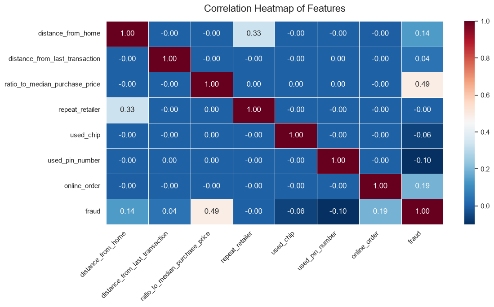

# 💳 Credit Card Fraud Detection

A machine learning project for detecting potentially fraudulent credit card transactions using supervised classification algorithms, exploratory data analysis, and techniques for handling highly imbalanced datasets.

---

## 📌 Project Overview

Credit card fraud detection is a **binary classification problem** where fraudulent transactions represent only a small portion of the total transactions.

The goal of this project is to build a machine learning pipeline that can distinguish between **legitimate and fraudulent transactions** while focusing on evaluation metrics such as **Precision, Recall, F1-Score, and ROC-AUC**, rather than relying only on accuracy.

This project covers the complete machine learning workflow:

* Data preprocessing
* Exploratory Data Analysis (EDA)
* Feature engineering
* Class imbalance analysis
* SMOTE-based oversampling
* Model training
* Model evaluation
* Model comparison
* Fraud prediction

---

## 🎯 Objectives

* Analyze and understand credit card transaction data.
* Perform data cleaning and preprocessing.
* Conduct exploratory data analysis.
* Identify patterns and characteristics of fraudulent transactions.
* Analyze the distribution of legitimate and fraudulent transactions.
* Handle class imbalance using **SMOTE**.
* Train multiple classification models.
* Compare models using relevant evaluation metrics.
* Identify an effective model for fraud detection.

---

## 🛠️ Technologies Used

### Programming Language

* Python

### Data Analysis

* Pandas
* NumPy

### Data Visualization

* Matplotlib
* Seaborn

### Machine Learning

* Scikit-learn
* Imbalanced-learn

### Development Environment

* Jupyter Notebook
* VS Code

### Deployment / Application

* Streamlit

---

## 📊 Dataset

The project uses transaction-level credit card data containing features related to individual transactions.

The target variable represents whether a transaction is:

* **0 → Legitimate transaction**
* **1 → Fraudulent transaction**

Fraud detection datasets are typically highly imbalanced, with legitimate transactions significantly outnumbering fraudulent ones. Therefore, special attention is given to the minority fraud class during preprocessing and evaluation.

---

## 🔍 Exploratory Data Analysis

Exploratory Data Analysis was performed to understand:

* Distribution of fraudulent vs. legitimate transactions
* Feature distributions
* Correlations between variables
* Potential outliers
* Patterns associated with fraudulent transactions

### Correlation Heatmap



### Class Distribution


### Fraud Outliers


---

## 🔄 Machine Learning Workflow

```text
Raw Dataset
     ↓
Data Loading
     ↓
Data Cleaning & Preprocessing
     ↓
Exploratory Data Analysis
     ↓
Feature Engineering
     ↓
Class Imbalance Analysis
     ↓
SMOTE
     ↓
Train/Test Split
     ↓
Model Training
     ↓
Model Evaluation
     ↓
Model Comparison
     ↓
Fraud Prediction
```

---

## ⚖️ Handling Class Imbalance

One of the major challenges in credit card fraud detection is **class imbalance**.

Since fraudulent transactions form a small percentage of the dataset, a model can achieve high accuracy simply by predicting most transactions as legitimate.

To address this issue, the project uses **SMOTE (Synthetic Minority Over-sampling Technique)** to generate synthetic samples for the minority fraud class.

This helps the models learn patterns associated with fraudulent transactions more effectively.

---

## 🤖 Machine Learning Models

The project experiments with multiple classification algorithms.

### 1. Logistic Regression

Used as a baseline classification model for distinguishing between fraudulent and legitimate transactions.

### 2. Decision Tree

Used to capture non-linear relationships between transaction features and fraud classification.

### 3. Random Forest

An ensemble learning algorithm that combines multiple decision trees to improve classification performance and robustness.

---

## 📈 Model Evaluation

Because fraud detection is an imbalanced classification problem, model performance is evaluated using multiple metrics.

### Precision

Measures how many transactions predicted as fraudulent were actually fraudulent.

### Recall

Measures how many actual fraudulent transactions were correctly identified.

### F1-Score

Provides a balance between Precision and Recall.

### ROC-AUC

Measures the model's ability to distinguish between fraudulent and legitimate transactions across different classification thresholds.

### Accuracy

Also considered, but it is **not used as the only performance metric** because of the highly imbalanced nature of fraud datasets.

---

## 📋 Project Structure

```text
Credit-card-fraud-detection/
│
├── app.py
├── CC_fraud.ipynb
├── card_transdata.csv
│
├── model.pkl
├── scaler.pkl
│
├── CORRHEAT.png
├── class distribution.png
├── fraud outliers.png
│
├── requirements.txt
├── README.md
├── CONTRIBUTING.md
├── LICENSE
└── Tests
```

---

## 🚀 Installation

### 1. Clone the repository

```bash
git clone https://github.com/Sneha-Das1/CreditCard-fraud-detection.git
```

### 2. Navigate to the project directory

```bash
cd CreditCard-fraud-detection
```

### 3. Create a virtual environment

```bash
python -m venv .venv
```

### 4. Activate the virtual environment

**Windows:**

```powershell
.venv\Scripts\activate
```

**macOS/Linux:**

```bash
source .venv/bin/activate
```

### 5. Install dependencies

```bash
pip install -r requirements.txt
```

---

## ▶️ Running the Project

### Jupyter Notebook

Launch Jupyter Notebook:

```bash
jupyter notebook
```

Open:

```text
CC_fraud.ipynb
```

and run the cells to reproduce the analysis and model training workflow.

### Streamlit Application

To run the prediction application:

```bash
streamlit run app.py
```

The application allows users to provide transaction information and obtain a fraud prediction from the trained machine learning model.

---

## 💾 Saved Models

The trained machine learning pipeline includes:

* `model.pkl` — trained classification model
* `scaler.pkl` — feature scaling object

These files allow the application to use the trained model for predictions without retraining it every time.

---

## 📊 Results

The models are compared using:

| Model               | Accuracy | Precision | Recall | F1-Score | ROC-AUC |
| ------------------- | -------: | --------: | -----: | -------: | ------: |
| Logistic Regression |        — |         — |      — |        — |       — |
| Decision Tree       |        — |         — |      — |        — |       — |
| Random Forest       |        — |         — |      — |        — |       — |

> **Note:** Replace the values above with the final evaluation results from `CC_fraud.ipynb`.

For fraud detection, the preferred model should not necessarily be the one with the highest accuracy. **Recall, Precision, F1-Score, and ROC-AUC** are particularly important when evaluating the ability to identify fraudulent transactions.

---

## 🔮 Future Improvements

Potential improvements include:

* Hyperparameter tuning using GridSearchCV or RandomizedSearchCV.
* Testing additional algorithms such as XGBoost and LightGBM.
* Threshold optimization for improving fraud recall.
* Real-time transaction monitoring.
* Model explainability using SHAP or LIME.
* Deployment using Streamlit Cloud or another cloud platform.
* Continuous model retraining using new transaction data.

---


## 📄 License

This project is licensed under the terms specified in the `LICENSE` file.

---

⭐ If you find this project useful, consider giving the repository a star!
